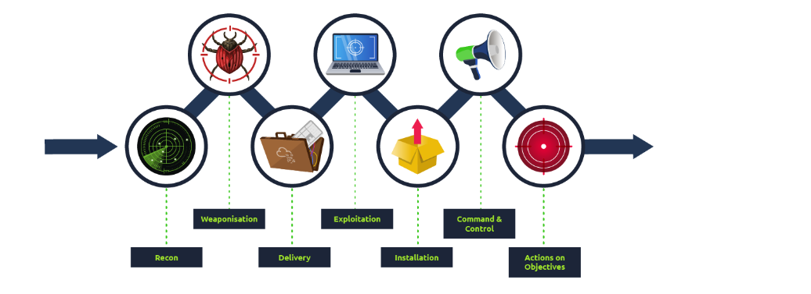

Cyber Kill Chain

Overview

The Cyber Kill Chain, developed by Lockheed Martin, is a cybersecurity framework that outlines the stages of a cyberattack. It helps security professionals detect, analyze, and mitigate threats at different points in the attack lifecycle.

Phases of the Cyber Kill Chain

The Cyber Kill Chain consists of seven phases:

1. Reconnaissance

The attacker gathers information about the target.

Includes scanning networks, identifying vulnerabilities, and collecting intelligence on employees.

2. Weaponization

The attacker creates a malicious payload.

Often involves developing malware, exploit kits, or phishing schemes.

3. Delivery

The attacker transmits the weaponized payload to the victim.

Common delivery methods include phishing emails, malicious downloads, and drive-by attacks.

4. Exploitation

The attacker exploits a vulnerability to execute the malicious payload.

Can involve privilege escalation, buffer overflow attacks, or social engineering tactics.

5. Installation

The attacker establishes a foothold in the victim’s system.

May include installing malware such as remote access trojans (RATs) or keyloggers.

6. Command and Control (C2)

The compromised system connects to the attacker's infrastructure.

Attackers can now issue commands, move laterally, and exfiltrate data.

7. Actions on Objectives

The attacker achieves their goal, such as data theft, sabotage, or espionage.

Depending on the attack, objectives may include encrypting files (ransomware) or modifying data.

Applications in Cybersecurity

Threat Detection: Identifies and mitigates attacks at different stages.

Incident Response: Helps security teams analyze and contain breaches effectively.

Defense Strategy: Guides organizations in implementing layered security controls.

Threat Intelligence: Provides insights into adversary tactics and techniques.

Example Use Case

A security team detects suspicious network traffic:

Reconnaissance: Logs show unusual scanning activity from an external IP.

Delivery: A phishing email with a malicious attachment is flagged.

Exploitation: The payload attempts to exploit a vulnerability.

C2: The infected system tries to contact an external server.

Mitigation: The security team isolates affected machines and applies patches.

Conclusion

The Cyber Kill Chain provides a structured approach to understanding cyberattacks and improving defenses. By identifying threats early in the chain, organizations can proactively disrupt attacks before they reach their objectives.


# Cyber Kill Chain Framework

## Overview
The **Cyber Kill Chain**, developed by **Lockheed Martin**, is a structured framework for understanding cyberattack behavior. It outlines the stages attackers follow, allowing defenders to detect and mitigate threats at each phase.

## Cyber Kill Chain Stages
The Cyber Kill Chain consists of **seven stages**:

| Stage | Description |
|--------|------------|
| **1. Reconnaissance** | Attackers gather intelligence on targets (e.g., scanning networks, phishing, OSINT). |
| **2. Weaponization** | Malicious tools and payloads are developed (e.g., malware creation, exploit kits). |
| **3. Delivery** | Attackers send malicious payloads to the victim (e.g., phishing emails, USB drops, drive-by downloads). |
| **4. Exploitation** | The payload exploits vulnerabilities in the target system (e.g., buffer overflow, privilege escalation). |
| **5. Installation** | Malware is installed on the system to establish persistence (e.g., backdoors, remote access trojans). |
| **6. Command & Control (C2)** | Attackers establish communication channels with the compromised system (e.g., botnets, C2 servers). |
| **7. Actions on Objectives** | The attackers achieve their goal (e.g., data exfiltration, ransomware deployment, system disruption). |

## Cyber Kill Chain Diagram
```mermaid
graph LR;
    A[Reconnaissance] --> B[Weaponization];
    B --> C[Delivery];
    C --> D[Exploitation];
    D --> E[Installation];
    E --> F[Command & Control];
    F --> G[Actions on Objectives];
