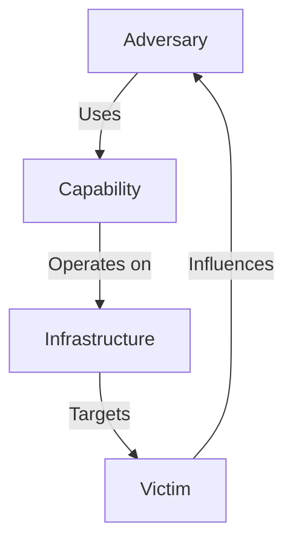

# Diamond Model of Intrusion Analysis

## Overview
The **Diamond Model of Intrusion Analysis** is a cybersecurity framework designed to understand and analyze cyber threats by mapping relationships between **Adversaries, Capabilities, Infrastructure, and Victims**. It provides a structured approach to **threat intelligence** and **incident response**.

## The Four Core Elements
The **Diamond Model** is built on four fundamental elements:

| Element | Description |
|---------|------------|
| **Adversary** | The attacker or threat actor responsible for the intrusion. |
| **Capability** | The tools, malware, or exploits used by the attacker. |
| **Infrastructure** | The network, IP addresses, and servers used to deliver the attack. |
| **Victim** | The target or entity affected by the attack. |

Each of these elements is interconnected, forming a **diamond shape** that represents an attack.

## Diamond Model Diagram

## Core Features of the Model
1. **Relationships & Attribution** – Helps map how attackers operate.
2. **Multiple Dimensions** – Can be extended with metadata (e.g., time, location, methodology).
3. **Link Analysis** – Enables tracking adversaries across different attacks.
4. **Scalability** – Can be used for both simple attacks and complex APT campaigns.

## Example Use Case
Imagine a **phishing attack** where:
- The **Adversary** is a cybercriminal group.
- The **Capability** is a malicious email attachment.
- The **Infrastructure** includes phishing domains and compromised servers.
- The **Victim** is an employee of a targeted organization.

By analyzing these relationships, defenders can identify **attack patterns**, improve **detection**, and mitigate threats proactively.

## Benefits of the Diamond Model
- **Structured Threat Analysis** – Helps analysts understand how attacks are executed.
- **Attribution and Tracking** – Enables better mapping of adversary behaviors.
- **Integration with Other Frameworks** – Can be combined with **MITRE ATT&CK** and **Cyber Kill Chain** for a comprehensive defense strategy.

## Limitations
- **Does not define specific attack techniques** – Needs integration with frameworks like **MITRE ATT&CK**.
- **Requires additional intelligence sources** – Relies on logs, reports, and forensic data.

## Additional Resources
- [The Diamond Model Whitepaper (PDF)](https://www.activeresponse.org/wp-content/uploads/2013/07/diamond.pdf)
- [MITRE ATT&CK Framework](https://attack.mitre.org/)

---

