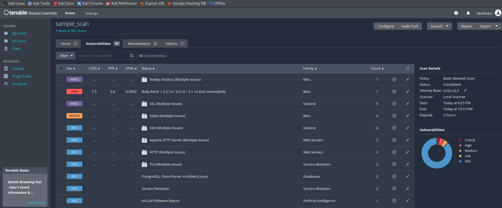

# Nessus Vulnerability Assessment Project
This project helps transform raw Nessus vulnerability scan data into a clear, actionable Excel report that maps each CVE to MITRE ATT&CK techniques and prioritizes remediation based on risk.

---

## 🎯 What This Project Solves

Security teams often struggle to:
- Correlate CVEs to attacker TTPs (tactics, techniques, and procedures).
- Decide which vulnerabilities to fix first.
- Communicate risk to non-technical stakeholders.

This script automates:
✅ Parsing Nessus scan CSV exports  
✅ Mapping CVEs to MITRE ATT&CK techniques  
✅ Determining exploitability and asset criticality  
✅ Generating a prioritized Excel remediation report  

---

## Repository Contents

- `scan_data/` - Raw exported CSV file and screenshots.
- `scripts/` - Python scripts for parsing and enrichment (in progress).
- `reports/` - Generated reports and documentation.

## Roadmap

- [ ] Develop CVE parsing script.
- [ ] Correlate MITRE ATT&CK mappings.
- [ ] Create markdown and Excel exports.
- [ ] Summarize remediation recommendations.

##  Screenshots

---

