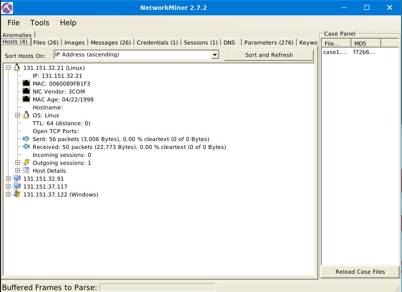
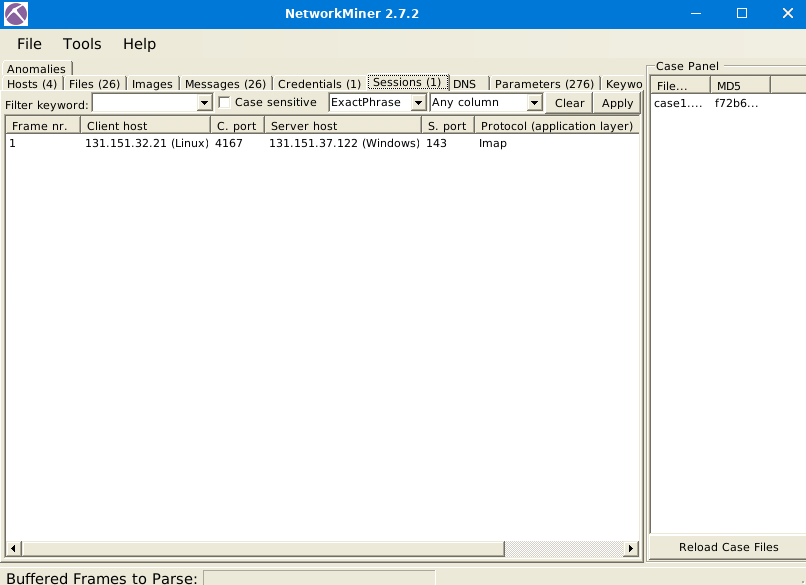
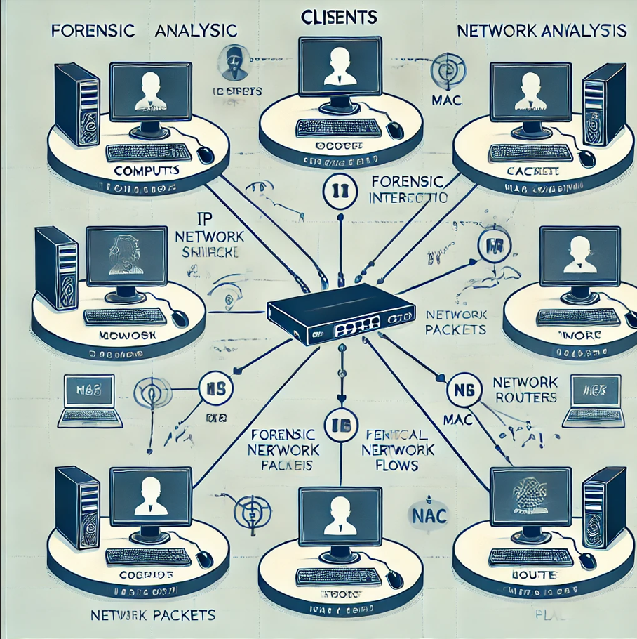

# 🔍 NetworkMiner Documentation  

## 📌 Introduction  
NetworkMiner is a **network forensic analysis tool (NFAT)** used for **passive network traffic analysis** and **packet capture extraction**. It extracts details like **IP addresses, MAC addresses, OS info, credentials, files, and session details** from network packets.  

---

## 🛠 Features Overview  
✔ Extracts **host details** (IP, MAC, OS, Ports)  
✔ Reconstructs **network sessions**  
✔ Retrieves **transferred files and credentials**  
✔ Works **offline with PCAP files**  
✔ Requires **no administrative privileges**  

---

## 🔧 Installation & Setup  
### **Requirements**  
- Windows/Linux  
- .NET Framework (Windows) or Mono (Linux)  
- PCAP files (captured with Wireshark/tcpdump)  

### **Installation Steps**  
1. **Download** NetworkMiner from the official website.  
2. **Extract** the ZIP file.  
3. **Run** `NetworkMiner.exe` (Windows) or use Mono (Linux).  

---

## 🚀 Using NetworkMiner  

### **1️⃣ Loading a PCAP File**  
- Click **File → Open** and select a **PCAP** file.  
- NetworkMiner will start **parsing network traffic** automatically.  

---

### **2️⃣ Host Tab**  
- Displays **all detected hosts** in the network.  
- Shows **IP, MAC, OS, and open ports**.  
- **Example Screenshot:**  
    

---

### **3️⃣ Sessions Tab**  
- Lists **network sessions** between client & server.  
- Shows **source/destination IPs, ports, and protocols**.  
- **Example Screenshot:**  
    

---

### **4️⃣ Extracting Files**  
- Navigate to the **Files tab** to see extracted files.  
- Right-click to **save** specific files for further analysis.  

---

### **5️⃣ Extracting Credentials**  
- Check the **Credentials tab** for **usernames & passwords** captured in network traffic.  
- Useful for investigating **plaintext authentication protocols**.  

---

## 📊 Network Analysis Diagrams  

### **📌 Network Host Interaction**   
This diagram illustrates how hosts interact in a forensic network analysis scenario.  

### **📌 Session Flow Example (IMAP Traffic)**  
The following diagram shows how IMAP traffic flows during an email session.  

 
---

## 🎯 Conclusion  
NetworkMiner is a **powerful forensic tool** for analyzing network traffic and extracting valuable information. It helps in **incident response, threat hunting, and security monitoring**.  

---

